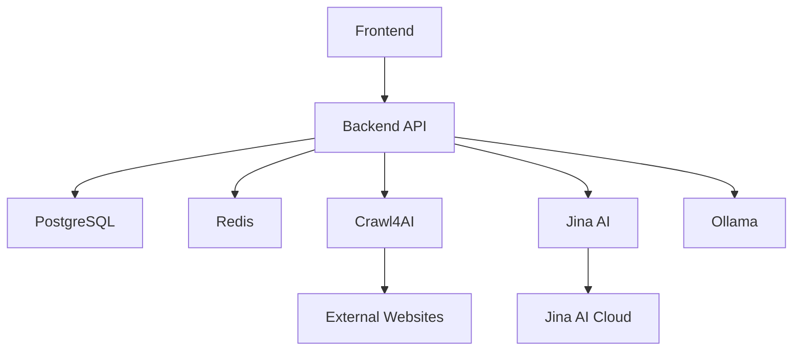

# SwissKnife AI Scraper - Project Overview

## 🎯 **Project Description**

SwissKnife AI Scraper is an intelligent, multi-modal web scraping platform that combines advanced AI capabilities with robust scraping infrastructure. The system provides natural language query processing, multimodal content extraction, and comprehensive data processing capabilities.

## 🏗️ **System Architecture**

### **High-Level Architecture**
```
┌─────────────────┐    ┌─────────────────┐    ┌─────────────────┐
│   React Frontend │    │  FastAPI Backend │    │  External APIs  │
│   (Port 8650)    │◄──►│   (Port 8601)    │◄──►│  Jina AI/Crawl4AI│
└─────────────────┘    └─────────────────┘    └─────────────────┘
         │                       │                       │
         │                       │                       │
         ▼                       ▼                       ▼
┌─────────────────┐    ┌─────────────────┐    ┌─────────────────┐
│   User Interface │    │   Core Services  │    │  AI Processing  │
│   - Dashboard    │    │   - Scraper      │    │  - NLP Engine   │
│   - Auth System  │    │   - Database     │    │  - LLM Manager  │
│   - Job Manager  │    │   - Cache        │    │  - Multimodal   │
└─────────────────┘    └─────────────────┘    └─────────────────┘
```

### **Core Components**

#### **1. Frontend Layer (React + TypeScript)**
- **Technology Stack**: React 18, TypeScript, Material-UI, Redux Toolkit
- **Port**: 8650
- **Key Features**:
  - User authentication and session management
  - Real-time dashboard with job monitoring
  - Project and content management interfaces
  - Responsive design with modern UI components

#### **2. Backend Layer (FastAPI + Python)**
- **Technology Stack**: FastAPI, Python 3.11, Pydantic, SQLAlchemy
- **Port**: 8601
- **Key Features**:
  - RESTful API with automatic OpenAPI documentation
  - JWT-based authentication system
  - Asynchronous request processing
  - Comprehensive error handling and logging

#### **3. Core Scraping Engine**
- **Primary Engine**: Crawl4AI Docker Service (Port 11235)
- **AI Integration**: Jina AI Reader/Search APIs
- **Features**:
  - Intelligent content extraction
  - Natural language query processing
  - Multimodal content handling (text, images, documents)
  - Performance optimization and caching

#### **4. Data Layer**
- **Primary Database**: PostgreSQL (Port 5434)
- **Cache Layer**: Redis (Port 6379)
- **Features**:
  - User data and session management
  - Project and job persistence
  - Content storage and indexing
  - Performance caching

#### **5. AI Processing Layer**
- **Local LLM**: Ollama (Port 11435)
- **External APIs**: Jina AI integration
- **Features**:
  - Natural language understanding
  - Query ambiguity resolution
  - Content analysis and summarization
  - Multimodal processing

## 🔧 **Technology Stack**

### **Frontend Technologies**
```typescript
{
  "framework": "React 18.2.0",
  "language": "TypeScript 4.9.5",
  "ui_library": "@mui/material 5.14.0",
  "state_management": "@reduxjs/toolkit 1.9.5",
  "routing": "react-router-dom 6.14.0",
  "http_client": "axios 1.4.0",
  "build_tool": "Vite 4.4.0"
}
```

### **Backend Technologies**
```python
{
  "framework": "FastAPI 0.104.1",
  "language": "Python 3.11",
  "async_runtime": "uvicorn 0.24.0",
  "database_orm": "SQLAlchemy 2.0.23",
  "validation": "Pydantic 2.5.0",
  "authentication": "python-jose 3.3.0",
  "http_client": "httpx 0.25.2"
}
```

### **Infrastructure Technologies**
```yaml
containerization: "Docker & Docker Compose"
database: "PostgreSQL 15"
cache: "Redis 7"
reverse_proxy: "Nginx"
ai_engine: "Crawl4AI + Jina AI"
llm_runtime: "Ollama"
```

## 📁 **Project Structure**

```
SwissKnife-AI-Scraper/
├── 📁 api/                     # FastAPI backend
│   ├── 📁 routes/              # API route definitions
│   │   ├── auth.py             # Authentication endpoints
│   │   ├── scraping.py         # Scraping endpoints
│   │   ├── health.py           # Health check endpoints
│   │   └── admin.py            # Admin endpoints
│   └── 📁 middleware/          # Custom middleware
├── 📁 core/                    # Core business logic
│   ├── scraper.py              # Main scraper class
│   ├── extraction_engine.py   # Content extraction
│   ├── nlp_processor.py        # NLP processing
│   └── multimodal_processor.py # Multimodal handling
├── 📁 services/                # External service integrations
│   ├── crawl4ai_client.py      # Crawl4AI integration
│   ├── jina_ai_client.py       # Jina AI integration
│   ├── llm_manager.py          # LLM management
│   └── performance_optimizer.py # Performance optimization
├── 📁 features/                # Feature implementations
│   ├── conversation_manager.py # Multi-step conversations
│   ├── proxy_manager.py        # Proxy management
│   └── batch_processor.py      # Batch processing
├── 📁 frontend/                # React frontend
│   ├── 📁 src/
│   │   ├── 📁 components/      # Reusable components
│   │   ├── 📁 pages/           # Page components
│   │   ├── 📁 services/        # API services
│   │   ├── 📁 store/           # Redux store
│   │   └── 📁 types/           # TypeScript types
│   ├── 📁 public/              # Static assets
│   └── package.json            # Dependencies
├── 📁 config/                  # Configuration files
│   ├── settings.py             # Application settings
│   └── database.py             # Database configuration
├── 📁 utils/                   # Utility functions
├── 📁 tests/                   # Test files
├── 📁 Docs/                    # Project documentation
├── 📁 Help/                    # Help documentation (this folder)
├── docker-compose.yml          # Docker services
├── Dockerfile                  # Backend container
├── main.py                     # Application entry point
└── requirements.txt            # Python dependencies
```

## 🌐 **Service Architecture**

### **Port Configuration**
| Service | Port | URL | Purpose |
|---------|------|-----|---------|
| Frontend | 8650 | http://localhost:8650 | React dashboard |
| Backend API | 8601 | http://localhost:8601 | FastAPI endpoints |
| Crawl4AI | 11235 | http://localhost:11235 | Scraping engine |
| PostgreSQL | 5434 | localhost:5434 | Primary database |
| Redis | 6379 | localhost:6379 | Cache & sessions |
| Ollama | 11435 | http://localhost:11435 | Local LLM |

### **Service Dependencies**


## 🔑 **Core Features**

### **1. Authentication System**
- **JWT-based authentication** with secure token management
- **User registration** with email validation
- **Session management** with automatic token refresh
- **Protected routes** with role-based access control

### **2. Intelligent Scraping**
- **Natural language queries** for content extraction
- **Multimodal processing** for text, images, and documents
- **Ambiguity resolution** for unclear requests
- **Performance optimization** with caching and batching

### **3. Content Management**
- **Project organization** with hierarchical structure
- **Job scheduling** and monitoring
- **Content storage** with metadata indexing
- **Export capabilities** in multiple formats

### **4. AI Integration**
- **Jina AI Reader** for intelligent content extraction
- **Local LLM processing** with Ollama
- **NLP pipeline** for query understanding
- **Conversation management** for multi-step interactions

### **5. User Interface**
- **Modern dashboard** with real-time updates
- **Responsive design** for all device types
- **Intuitive navigation** with sidebar and breadcrumbs
- **Dark/light theme** support

## 🔄 **Data Flow**

### **Typical Scraping Request Flow**
1. **User Input**: User submits natural language query via frontend
2. **Authentication**: JWT token validation and user identification
3. **Query Processing**: NLP analysis and intent recognition
4. **Scraping Execution**: Crawl4AI processes the target website
5. **AI Enhancement**: Jina AI extracts and processes content
6. **Data Storage**: Results stored in PostgreSQL with metadata
7. **Response Delivery**: Processed data returned to frontend
8. **UI Update**: Dashboard updates with new content

### **Authentication Flow**
1. **Registration/Login**: User credentials processed by backend
2. **Token Generation**: JWT token created with user claims
3. **Token Storage**: Secure storage in browser localStorage
4. **Request Authorization**: Token included in API requests
5. **Token Validation**: Backend verifies token on each request
6. **Session Management**: Automatic token refresh when needed

## 🎯 **Key Design Principles**

### **1. Modularity**
- **Separation of concerns** with clear module boundaries
- **Pluggable architecture** for easy feature extension
- **Service-oriented design** with independent components

### **2. Scalability**
- **Asynchronous processing** for high-performance operations
- **Caching strategies** for improved response times
- **Horizontal scaling** support with containerization

### **3. Security**
- **JWT authentication** with secure token handling
- **Input validation** at all API endpoints
- **CORS configuration** for secure cross-origin requests
- **Environment-based secrets** management

### **4. User Experience**
- **Intuitive interface** with modern design patterns
- **Real-time feedback** for long-running operations
- **Error handling** with user-friendly messages
- **Responsive design** for all device types

### **5. Maintainability**
- **Comprehensive documentation** for all components
- **Type safety** with TypeScript and Pydantic
- **Testing coverage** for critical functionality
- **Code quality** with linting and formatting

## 🚀 **Getting Started**

For complete setup instructions, see:
- **[Setup & Installation Guide](./06_SETUP_INSTALLATION.md)**
- **[Port Configuration](./04_PORT_CONFIGURATION.md)**
- **[Development Guide](./07_DEVELOPMENT_GUIDE.md)**

## 📚 **Additional Resources**

- **API Documentation**: http://localhost:8601/docs (when running)
- **Frontend Source**: `frontend/src/` directory
- **Backend Source**: `api/`, `core/`, `services/` directories
- **Configuration**: `config/` directory
- **Tests**: `tests/` directory

---

**Last Updated**: August 6, 2025  
**Version**: 2.2.0  
**Status**: Production Ready